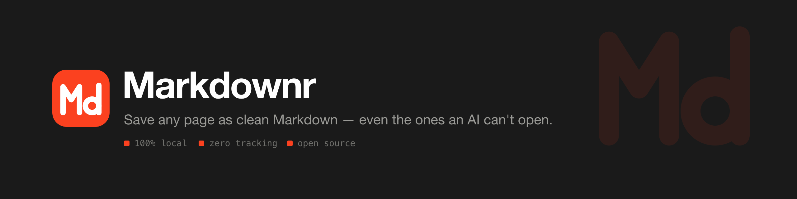

<p align="center">
  
</p>

<p align="center">
  <a href="https://github.com/sidhanth-povil/markdownr/releases/latest"></a>
  
  
  
</p>

<p align="center">
  <a href="https://sidhanth-povil.github.io/markdownr/"><b>Website</b></a> ·
  <a href="https://github.com/sidhanth-povil/markdownr/releases/download/v0.1.0/markdownr-chrome-mv3-0.1.0.zip"><b>Download&nbsp;.zip</b></a> ·
  <a href="https://sidhanth-povil.github.io/markdownr/privacy.html"><b>Privacy</b></a>
</p>

---

Build a research corpus from sources an assistant **can't** reach — a paid newsletter, a paywalled
journal, your logged-in library database, a private Notion — captured as clean, citation-ready
Markdown with author, publication date, and source URL in the frontmatter.

Reader, full-page, or selection — with a live preview, and a character/token count so you know it
fits the context window before you paste.

> **Install now:** [download the latest build](https://github.com/sidhanth-povil/markdownr/releases/latest), unzip it, then open `chrome://extensions` → **Developer mode** → **Load unpacked** → pick the folder. Chrome Web Store listing coming soon.

## Why not just paste the URL?

For a public blog post, you often can — most assistants will fetch it themselves. Markdownr is for the pages they **can't** reach:

- **Behind a login** — a paid newsletter, a support thread, a private doc. Markdownr runs in your browser, in your session, so it sees what you see.
- **Localhost and intranet** — `localhost:3000`, staging, internal wikis and dashboards. No external fetcher gets in.
- **JavaScript-rendered pages** — URL fetchers frequently get the pre-hydration shell and return nothing useful. Markdownr reads the live DOM after render.
- **Just this part** — select three paragraphs and convert only those. A URL can't express that.
- **Nothing leaves your machine** — pasting a URL into a hosted reader tells that service what you're reading. This makes no network request at all (see [Privacy](#privacy)).

## Built for citation

The frontmatter is the point, not decoration. Markdownr reads metadata from meta tags **and** JSON-LD
(where modern platforms actually keep the date) **and** the `citation_*` tags used by arXiv, PubMed,
and academic journals — so a captured source arrives with the provenance a lit review needs:

```yaml
---
title: "Attention Is All You Need"
url: "https://arxiv.org/abs/1706.03762"
author: "Vaswani, Ashish"
date: "2017/06/12"
captured: "2026-07-21T09:00:00.000Z"
---
```

## See the difference

Naive HTML→Markdown converters mangle the two things a knowledge worker most needs intact:

| On the page | A naive converter gives | Markdownr gives |
|---|---|---|
| `E = mc²` (KaTeX/MathJax) | `E\=mc2E=mc^2E\=mc2` — the renderer's three layers concatenated | `$E=mc^2$` — the original LaTeX |
| A page with a hidden "related posts" block | *a different article entirely*, right title, no error | the article you were actually reading |
| A fenced code block | ` ``` ` — language lost | ` ```python ` — language preserved |

These aren't cosmetic. The math one makes a paper unreadable to an LLM; the "wrong article" one puts
false content in your notes with nothing to flag it.

## Features

- **Three capture modes** — Reader (just the article), Full page, or Selection.
- **Live preview** in the popup before you copy.
- **Three triggers, one behavior** — toolbar icon, `Alt+M`, or right-click "Copy page as Markdown". They run the same converter, so nothing is a dead button. Right-clicking a selection converts that selection.
- **Robust extraction** — strips cookie/consent junk *before* parsing, and if Reader mode grabs a suspiciously tiny sliver (the classic CookieYes / Elementor bug) it auto-falls back to the full page.
- **Real metadata** — YAML frontmatter with title, URL, subtitle, author and publication date, read from meta tags *and* JSON-LD, where most modern platforms actually keep the date.
- **Math becomes LaTeX** — KaTeX and MathJax render each expression twice (MathML plus a visual layer), which naive converters emit as duplicated soup. Markdownr pulls the original TeX: `$E=mc^2$`.
- **Code keeps its language** — ` ```python `, not a bare fence, across highlight.js, Prism and GitHub markup. GFM tables always on.
- **Cite in one click** — copy any captured source as **BibTeX** or **RIS**, built from the extracted metadata, ready for Zotero / Overleaf / Obsidian.
- **Your own tags** — add Obsidian-style `tags:` to the frontmatter (nested `topic/subtopic` supported).
- **Batch the whole session** — "All tabs" captures every open tab into one research document: a table of contents plus each source under its own heading and URL.
- **Toggles** — images, links, YAML frontmatter, absolute URLs.
- **Export** — copy, download `.md`, or "copy as prompt" (wrapped for pasting into an LLM). A live character/token count tells you if it fits your context window.

## What the output looks like

A Substack post, Reader mode, defaults:

```markdown
---
title: "The Model Is Not The Product"
url: "https://thenuancedperspective.substack.com/p/the-model-is-not-the-product"
description: "Harness Engineering: Part 1 of 3"
author: "Ravi Yenduri"
date: "2026-07-18T05:41:25+05:30"
captured: "2026-07-20T09:35:34.104Z"
---
Most AI products fail somewhere other than the model. They fail in the software
around it: the part that decides what the model sees, what it can do, how actions
run, and what gets verified.

## The Mistake
...
```

No nav, no subscribe box, no comments, no share buttons. Headings, emphasis and links intact.

## Why it's different from the one you tried

| Known complaint about existing extensions | What Markdownr does |
|---|---|
| Clicking the icon does nothing | Icon opens the popup UI directly; every trigger shares one code path. |
| Cookie-consent banner captured instead of the article | Consent selectors stripped before Readability runs, with a size guard so a loose selector can't eat the article. |
| Page-builder pages truncated to a few sentences | Length-sanity check → auto fallback to full-page capture. |
| Math and code arrive mangled | LaTeX pulled from the renderer; fence languages preserved. |
| "How do I even use it?" | The popup *is* the UI — visible modes, toggles, and preview. |

## Install

**From the Chrome Web Store:** _(link once published)_

**From source:**

```bash
npm install
npm run build      # outputs build/chrome-mv3-prod
```

Then in Chrome: `chrome://extensions` → enable Developer mode → **Load unpacked** → select `build/chrome-mv3-prod`.

## Develop

```bash
npm run dev        # hot-reload dev build in build/chrome-mv3-dev
npm test           # all three suites
```

- `lib/convert.ts` — extraction + HTML→Markdown pipeline (the core).
- `content.ts` — runs the converter in the page, handles clipboard.
- `background.ts` — context menu + notifications.
- `popup.tsx` — the UI.

### Tests

| Suite | Covers |
|---|---|
| `lib/convert.test.ts` | Pure HTML→Markdown: formatting, options, frontmatter escaping, code fence languages, math |
| `lib/extract.test.ts` | DOM extraction via jsdom — each case is a regression test pinned to a bug that actually happened on a real site |
| `lib/privacy.test.ts` | Fails the build if a network call appears anywhere in the source |

Bug fixes land as a test case first. If you find a page that converts badly, the URL is the most
useful thing you can report.

## Privacy

Full policy: [PRIVACY.md](PRIVACY.md).

Conversion is 100% local. No analytics, no telemetry, no account, no server — the extension makes
**zero network requests**, and `lib/privacy.test.ts` fails the build if `fetch`, `XMLHttpRequest`,
`WebSocket`, `sendBeacon` or `EventSource` ever appears in the source. The claim is enforced, not
just promised.

### Permissions

| Permission | Why |
|---|---|
| `activeTab` | Read the current tab's title for the download filename |
| `storage` | Remember your toggle settings |
| `contextMenus` | The right-click "Copy page as Markdown" entry |
| `notifications` | Confirm the copy succeeded when using the context menu |

Plus host access for the content script, to read the page you convert. Nothing is requested that
isn't used.

## Known limitations

- **Reader mode drops most section headings on Wikipedia.** Wikipedia wraps headings in
  `div.mw-heading` and Readability's scoring culls them — on a typical article Reader returns 2
  headings where Full page returns 13. **Use Full page mode for Wikipedia.** Substack, Ghost and
  standard article markup are unaffected.
- **Lazy-loaded content below the fold** is only captured if it's already in the DOM. Scroll the
  page first if a long article looks short.
- **Content inside a shadow root is not captured.** Rare on article pages — mostly embedded
  widgets, which get stripped anyway — but common on app-like pages and internal tools. Closed
  shadow roots are unreadable from an extension by design, so this can't be fully solved.
- **Tables with merged cells degrade.** GFM markdown can't express `rowspan`/`colspan`, so those
  rows come out short. Definition lists (`<dl>`) flatten to paragraphs for the same reason.
- **PDF tabs and `chrome://` pages** can't be converted — there's no page HTML to read.

## Credits

The idea of a one-click "page → Markdown" browser extension was inspired by
[.MD this page](https://github.com/Ademking/MD-This-Page) by Adem Kouki. Markdownr is an
independent implementation — a different extraction pipeline (Mozilla Readability + Turndown),
a different popup-based architecture, and its own feature set — and shares no code with it. Thanks
to that project for the concept.

## License

MIT. Contributions welcome.
